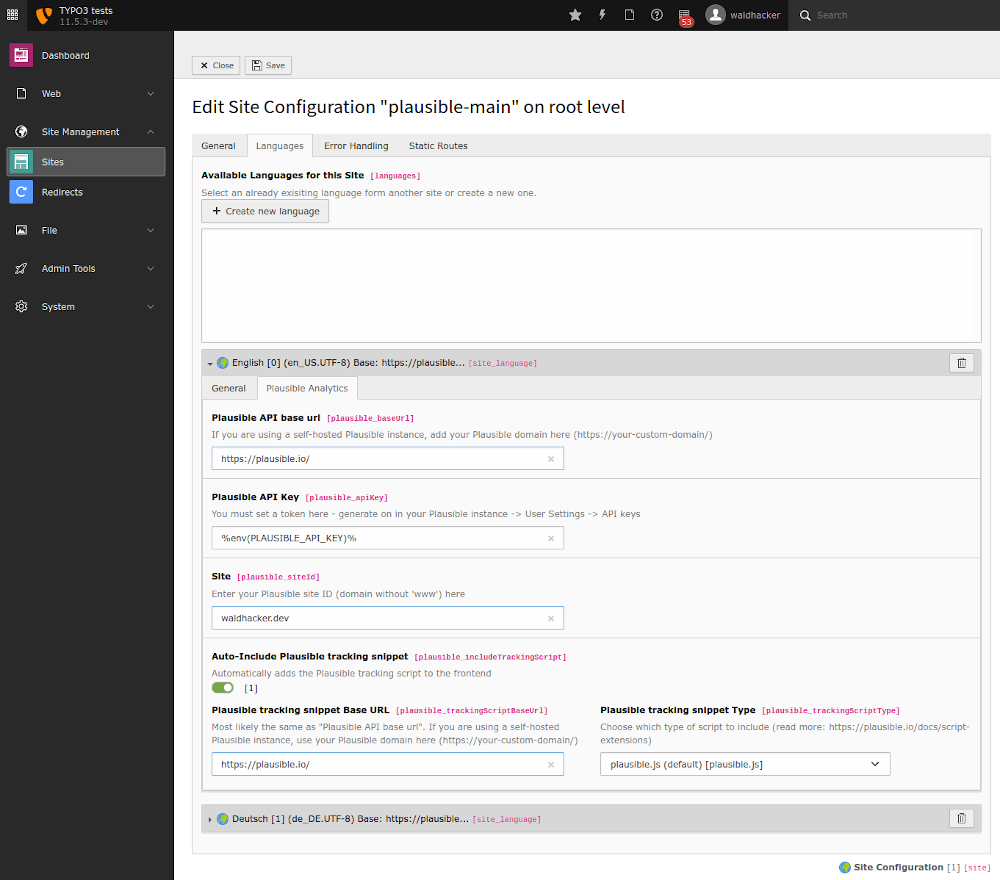
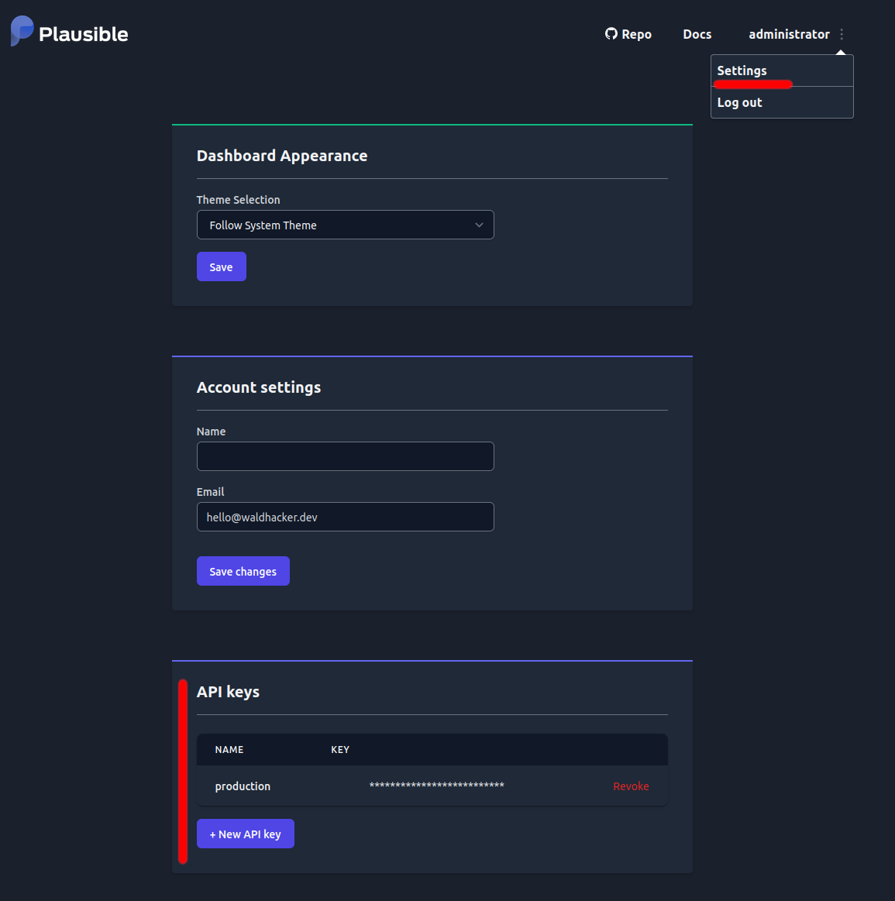
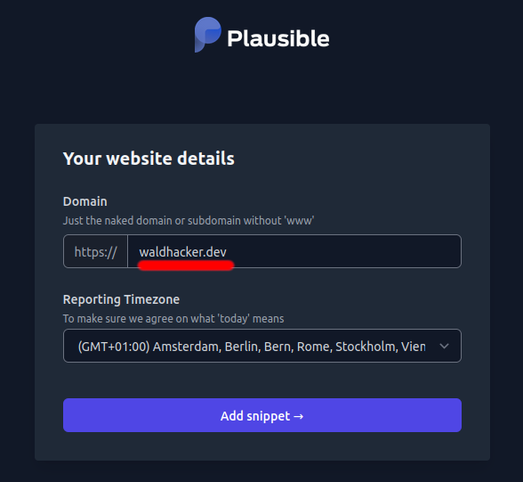
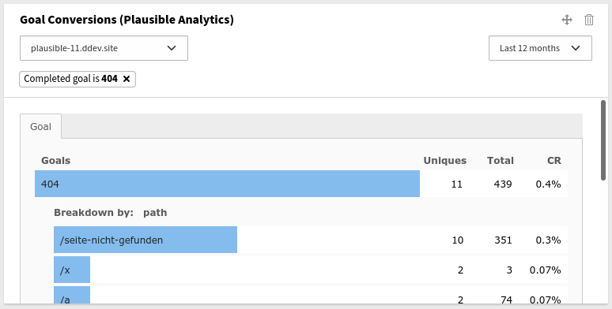
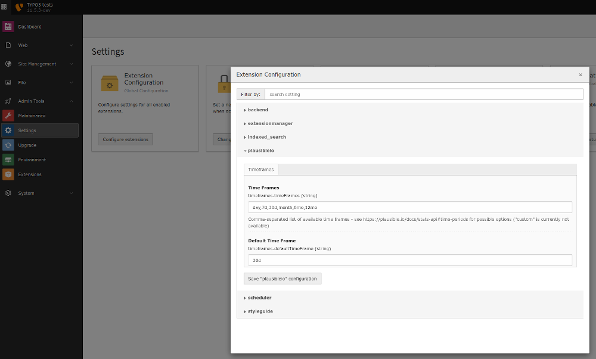

.. include:: ../Includes.txt

.. _configuration:

=============
Configuration
=============

Site Language
=============

The extension is mainly configured within the site language `Site Management` / `Sites` / `<site configuration>` / `Languages` / `<site language>` / `Plausible Analytics`

The following settings are available:

Plausible API base url
----------------------

The base URL where the Plausible API endpoints are accessible.
If you use the plausible.io service it is `https://plausible.io/`.
If you are using a self-hosted Plausible instance, add your Plausible domain here (like `https://analytics.example.com/`).

Plausible API Key
-----------------

A Plausible API Token.
If you don't have one yet, you can create one in your Plausible instance at `Settings` / `API keys`

Site
----

A Plausible site ID.
This is typically your domain or subdomain without `www` (like `waldhacker.dev` or `blog.waldhacker.dev`).
The Site ID is also the one you entered in your Plausible instance when you created a new site using the `+ Add a website` button.

Auto-Include Plausible tracking snippet
---------------------------------------

If switched on, then the `Plausible tracking script <https://plausible.io/docs/plausible-script>`__ is automatically included in the frontend.

If you don't want automatic integration, you can also insert the script manually using the asset collector within your templates like this:

.. code-block:: html

   <f:asset.script identifier="analytics" src="https://plausible.io/js/plausible.js" data="{'domain':'waldhacker.dev'}" priority="1" async="async" defer="defer" />

Plausible tracking snippet Base URL
-----------------------------------

The base URL where the Plausible tracking scripts are accessible.
It must be the part before `js/plausible.js`. So if your Plausible tracking scripts are available at `https://analytics.example.com/js/plausible.js` then put `https://analytics.example.com/` here.
If you use the plausible.io service it is `https://plausible.io/`.

The URL is most likely the same as the "Plausible API base url". However, it may happen that the tracking script should be loaded from another domain `because of adblockers <https://plausible.io/docs/proxy/introduction>`__.
Therefore the Plausible tracking scripts base URL must be configured separately here.

Plausible tracking snippet Type
-------------------------------

Plausible `offers different tracking scripts <https://plausible.io/docs/script-extensions>`__ for various use cases.
One of these scripts can be selected here (the default ist `plausible.js`).

Server side automatic 404 error tracking
----------------------------------------

If this option is activated, all page not found errors (404) are recorded in Plausible as a custom event. The tracking of the 404 error includes the entire page for which the corresponding language configuration with the corresponding Plausible Analytics configuration was created. The tracking is independent of the settings made under `Site Management` / `Sites` / `<site configuration>` / `Error Handling`. With this option, 404 errors can therefore be registered without further configuration or script integration.

The 404 errors are displayed via the Goal widget. For this to work, a 404 custom event must be created in the Plausible backend. How this is done is described in the `Plausible documentation <https://plausible.io/docs/error-pages-tracking-404#step-3-create-a-custom-event-goal-in-your-plausible-analytics-account>`__ (only step 3 of the instructions is needed for this).
If you want to see which non-existent pages were called up, you have to click on the 404 bar in the Goal widget, if it is present. If there is no such entry in the Goal list, there has not yet been a 404 error.

Extension configuration
=======================

Some options are configured within the extension configuration at `Admin Tools` / `Extension Configuration` / `plausibleio`

Time Frames
-----------

Comma-separated list of available selectable time frames within the dashboard widgets - see `https://plausible.io/docs/stats-api#time-periods <https://plausible.io/docs/stats-api#time-periods>`__ for possible options (`custom` is currently not available).

Default Time Frame
------------------

The time frame to use initially when rendering the widgets.

Advanced configuration
======================

Service.yaml
------------

If you want to see multiple widgets with preconfigured values on one dashboard, this is possible via the widget configuration in the file :file:`Configuration/Services.yaml`.
So it is possible to create e.g. the `Countries` widget 2 times on the dashboard. One which shows the country map for `site1.example.com` and one which shows the country map for `site2.example.com`.

Copy the `waldhacker.plausibleio.widget.country` widget from the file :file:`EXT:plausibleio/Configuration/Services.yaml`

.. code-block:: yaml

  waldhacker.plausibleio.widget.country:
    class: 'Waldhacker\Plausibleio\Dashboard\Widget\CountryMapDataWidget'
    arguments:
      $view: '@dashboard.views.widget'
      $configurationService: '@Waldhacker\Plausibleio\Services\ConfigurationService'
      $options:
        siteId: null
        timeFrame: null
    tags:
      - name: dashboard.widget
        identifier: 'plausible.countrymapdata'
        groupNames: 'plausibleio'
        title: 'LLL:EXT:plausibleio/Resources/Private/Language/locallang.xlf:widget.countryMapData.label'
        description: 'LLL:EXT:plausibleio/Resources/Private/Language/locallang.xlf:widget.countryMapData.description'
        iconIdentifier: 'content-widget-chart-bar'
        height: 'medium'
        width: 'medium'

into your site package :file:`Configuration/Services.yaml` file and adjust the configuration like this

.. code-block:: yaml

  # Countries widget fixed to site1.example.com
  yourname.plausibleio.widget.country.site1:
    class: 'Waldhacker\Plausibleio\Dashboard\Widget\CountryMapDataWidget'
    arguments:
      $view: '@dashboard.views.widget'
      $configurationService: '@Waldhacker\Plausibleio\Services\ConfigurationService'
    $options:
      siteId: site1.example.com
      timeFrame: 30d
  tags:
    - name: dashboard.widget
      identifier: 'yourname.countrymapdata.site1'
      groupNames: 'plausibleio'
      title: 'LLL:EXT:yourpackage/Resources/Private/Language/locallang.xlf:widgets.countryMapData.label'
      description: 'LLL:EXT:yourpackage/Resources/Private/Language/locallang.xlf:widgets.countryMapData.description'
      iconIdentifier: 'content-widget-chart-bar'
      height: 'medium'
      width: 'medium'

  # Countries widget fixed to site2.example.com
  yourname.plausibleio.widget.country.site2:
    class: 'Waldhacker\Plausibleio\Dashboard\Widget\CountryMapDataWidget'
    arguments:
      $view: '@dashboard.views.widget'
      $configurationService: '@Waldhacker\Plausibleio\Services\ConfigurationService'
    $options:
      siteId: site2.example.com
      timeFrame: 30d
  tags:
    - name: dashboard.widget
      identifier: 'yourname.countrymapdata.site2'
      groupNames: 'plausibleio'
      title: 'LLL:EXT:yourpackage/Resources/Private/Language/locallang.xlf:widgets.countryMapData.label'
      description: 'LLL:EXT:yourpackage/Resources/Private/Language/locallang.xlf:widgets.countryMapData.description'
      iconIdentifier: 'content-widget-chart-bar'
      height: 'medium'
      width: 'medium'

Within :yaml:`$options` you have the possibility to fix a widget to a plausible site ID and/or to a time frame.

Migration from version 1.x to 2.x
=================================

In version 1.x the options "Plausible API base url" (`baseUrl`), "Plausible API Key" (`apiKey`) and "Site" (`siteId`) were set within the extension configuration (:php:`$GLOBALS['TYPO3_CONF_VARS']['EXTENSIONS']['plausibleio']`).
However, this only allowed the configuration of one Plausible site ID within the TYPO3 installation.

These 3 configuration options have been moved to the site language configurations with version 2.x.
You have to manually transfer the values you entered in the extension configuration (version 1.x) to the site language configuration, there is no automated migration script.
