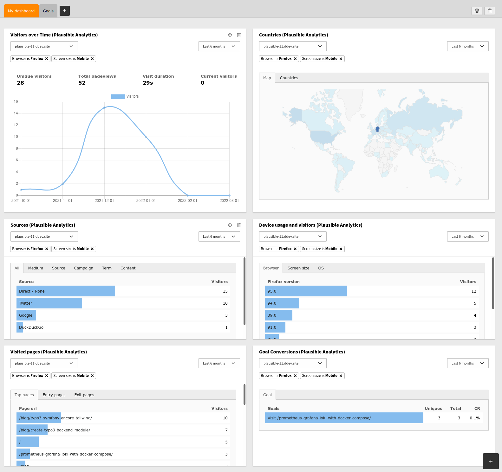

.. include:: ../Includes.txt

.. _for-editors:

===========
For Editors
===========

To use the extension, go to the TYPO3 Dashboard and click the "Add Widget" button
to add new widgets.

From the "Site Analytics (Plausible)" tab, choose the statistic widgets you want to add.

Most of the widget data is self-explanatory. The more specific analysis data is presented in more detail below.

Data configuration
==================

| In each widget, the analysis data to be used can be configured in the header. This includes the ability to specify the time period to be analysed and the site for which the data was collected.
| This configuration applies to all widgets in the corresponding dashboard. Accordingly, a change in one widget is applied to all other widgets. In another dashboard, you can make different configurations, which then only apply in this dashboard. In this way, different combinations of configurations can be used in different dashboards.
| The configurations are saved for the respective user across sessions.

Filter
======

| The analysis can be narrowed down or specified by means of filters. If you filter according to a certain criterion, only the data that meet this criterion are displayed.
| For example, you can filter for page visits made from a mobile device. In order to then be able to see via which external pages the users of such devices have reached one's own page or which browser visitors to one's own page with such devices use most often or least often.
| To filter by a criterion, simply click on it (in most cases, the text in the blue bars). In some cases, more detailed data is then displayed for the criterion being filtered. For example, if you filter by a specific browser, the Device widget under Browser will now show the different versions of that browser that visitors use to visit the site. Or, if you filter by a specific country that visitors come from, the Counties widget now displays the states of that country as a more detailed analysis, and if you filter by a state, the cities of that state that visitors come from are displayed.
| The detailed display of states and cities on a self-hosted Plausible is only available if the IP geolocation database has been installed. Plausible uses the database from `DBIP <https://db-ip.com/>`__

For more information see also: `https://plausible.io/docs/countries#how-it-works <https://plausible.io/docs/countries#how-it-works>`__

For the use of filters in the Goals widget, see the :ref:`GoalsWidget` section.

As with the data configuration of the widgets, the filters also apply to all widgets of the corresponding dashboard. This means that if you add a filter to one widget, it will also be added to all other widgets. Accordingly, other filter combinations can be selected in another dashboard. The filter configurations are saved for the respective user across sessions.

Plausible itself supports `exclusion filters <https://plausible.io/docs/filters-segments#exclude-specific-segments-of-traffic>`__. Unfortunately, this feature is not yet available in the TYPO3 extension.

Widgets
=======

A description of the individual analysis data can be found in the Plausible documentation under `https://plausible.io/docs/guided-tour <https://plausible.io/docs/guided-tour>`__ and a definition of all metrics under `https://plausible.io/docs/metrics-definitions <https://plausible.io/docs/metrics-definitions>`__.

The widgets in the TYPO3 extension may differ slightly in structure from those in the Plausible dashboard and may not always contain the same data sections.

Sources widget
--------------

| The data in the Source widget is not self-explanatory, so please see the following introduction: `https://plausible.io/docs/top-referrers <https://plausible.io/docs/top-referrers>`__.
| Now for a brief explanation of the background of the Sources widget. There are some cases where no referrer is passed and many cases where it is restricted to the domain. This can lead to a large part of origins of page visits witch where not being resolved or being resolved inadequately. To increase the accuracy of sources analysis and minimise the increase in visits without source information, it is useful to be aware of the following information about link tagging:
| `https://plausible.io/blog/referrer-policy <https://plausible.io/blog/referrer-policy>`__
| `https://plausible.io/docs/manual-link-tagging <https://plausible.io/docs/manual-link-tagging>`__
| `https://plausible.io/blog/utm-tracking-tags <https://plausible.io/blog/utm-tracking-tags>`__

.. _GoalsWidget:

Goals widget
------------

| Plausible offers the possibility to record goals and events. This can be, for example, that visitors register for a certain service of the page (e.g. newsletter), they press a button (download button) or call up the link to an external page. To be able to record goals and events, the javascript API or the server endpoint of plausible must be used. Detailed information on this can be found in the Plausible `documentation <https://plausible.io/docs/goal-conversions>`__.
| After a goal has been set up, it is displayed in the Goal Conversions widget as soon as it has been converted for the first time. Three values are displayed for each goal. The *Uniques (Unique Conversions)*, the *Totals (Total Conversions)* and the *CR (Conversion Rate)*. The *Unique Conversions* are the number of people who fulfilled the goal. *Unique Conversions* differ from Total Conversions in that a user can fulfil a certain goal (e.g. follow a link to an external page) several times. In most cases, however, it is relevant that the goal is fulfilled at all and that it is recognisable how many different visitors have fulfilled it. The *Total Conversions* indicate how often the goal was fulfilled in total, i.e. counting that visitors may have fulfilled it several times. The *Conversion Rate (CR)* indicates the ratio of how many of all page visitors have converted the Goal. If, for example, 2 out of a total of 10 page visitors have converted a certain goal (e.g. registration for the newsletter), the *CR* for this goal would be 20%.
|

It is possible to assign user-defined properties (Custom Properties) to events respectively goals. This makes it possible to subdivide a specific goal even more finely and to collect data that is not recorded by Plausible. Further information can be found under `https://plausible.io/docs/custom-event-goals#using-custom-props <https://plausible.io/docs/custom-event-goals#using-custom-props>`__.
If a goal has Custom Properties, these can be displayed by setting the corresponding goal as a filter, i.e. by pressing on the text of the goal in the blue bar. It is also possible to filter by custom properties, but there is currently still the restriction in Plausible (see `https://plausible.io/docs/stats-api#custom-props <https://plausible.io/docs/stats-api#custom-props>`__) that you can only filter by a custom property if you also filter by the corresponding goal. If the filter for the goal is removed, the filter for the custom property is also removed automatically.

Filtering by a goal will affect the data in all other widgets of the corresponding dashboard, except for *Unique Visitors* in the *Visitors over Time* widget. This value remains unfiltered as it is the reference value of all visitors to the one who converted the goal.
If you filter for a goal, all other widgets now display data relating to this goal. It is no longer the visitors counted for a metric that are displayed, but how often visitors who fulfilled this metric converted the goal (conversions) and how this number relates to the number of all page visitors (CR). For example, the Countries widget shows from which countries visitors came who fulfilled the corresponding goal and how often the conversion of the goal was counted for each country.

.. warning::
   Note that you must ensure that no personally identifiable information (PII) is sent to Plausible Analytics with custom properties. PII is information that could be used on its own to identify, contact, or precisely locate an individual. This includes:

   - full names or usernames
   - email addresses
   - mailing addresses
   - phone numbers
   - credit card information
   - passport numbers
   - precise locations
   - IP addresses
   - pseudonymous cookie IDs, advertising IDs or other pseudonymous end user identifiers

Countries widget
----------------

.. warning::
   The detailed display of states and cities on a self-hosted Plausible is only available if the IP geolocation database has been installed. Plausible uses the database from `DBIP <https://db-ip.com/>`__
