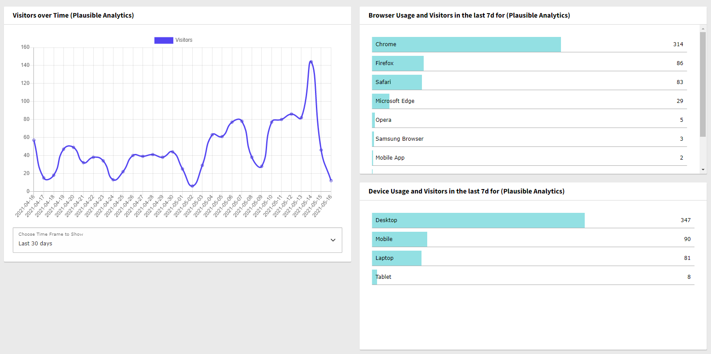

# TYPO3 Dashboard Widgets for Plausible Analytics

Provides TYPO3 Backend Dashboard Widgets displaying Plausible Analytics Data for your site.
Plausible Analytics is a privacy-friendly analytics alternative - you can either use their
service at https://plausible.io or self-host the service on your own platform.



## Installation

### With Composer

`composer require waldhacker/typo3-plausibleio`

### Without Composer

- Download the extension from the TER
- Install it with the Extension Manager

## Configuration

The extension is configured via the extension settings in "Admin Tools" > "Settings".
The following settings are available:

```
Plausible Base URL: If you are using a self-hosted plausible instance, add your domain here (https://<your-custom-domain>/)
baseUrl = https://anna.susi.dev/

API Key: You must set a token here - generate on in your Plausible instance -> User Settings -> API keys
apiKey =

Sites: Enter your Plausible site ID (domains) here - if you have more than one, use a default one here and add multiple widget configurations with different sites via services.yaml
siteId = susi.dev

Time Frames: Comma-separated list of available time frames - see https://plausible.io/docs/stats-api#time-periods for possible options ("custom" is currently not available)
timeFrames = day,7d,30d,month,6mo,12mo

Default Time Frame: The time frame to use initially when rendering the widgets
defaultTimeFrame = 30d
```

## Integrating Plausible Analytics in the frontend

This extension does not provide any frontend integration for plausible. Since TYPO3 v10 you can use the TYPO3 AssetCollector to add the analytics script to your website directly in your templates, no extension necessary - for example:

```
<f:asset.script identifier="analytics" src="https://plausible.io/yoursite/js/plausible.js" data="{'domain':'example.com'}" priority="1" async="async" defer="defer" />
```
