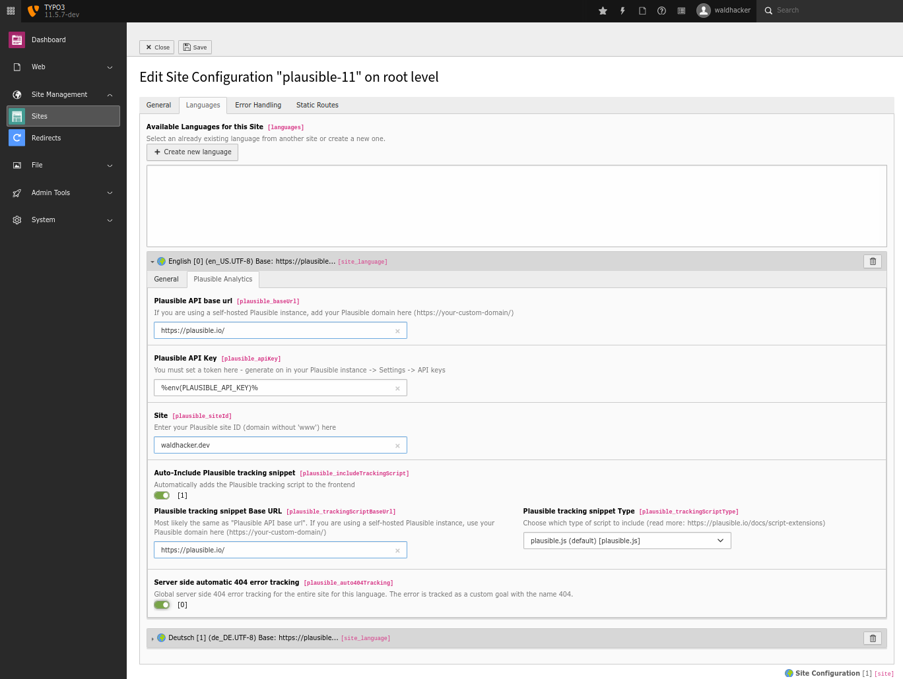

# Privacy-friendly analytics integration for TYPO3 CMS with Plausible Analytics.

Analyze your audience with Plausible Analytics and see nice dashboards with analytics data directly in the TYPO3 backend.

Plausible Analytics is a privacy-friendly, cookieless, lightweight and open-source analytics alternative - you can either use their
service at [https://plausible.io](https://plausible.io) or [self-host the service](https://plausible.io/docs/self-hosting) on your own platform.


## Installation

### With Composer

`composer require waldhacker/typo3-plausibleio`

### Without Composer

- [Download](https://extensions.typo3.org/extension/plausibleio) the extension from the TER
- Install it with the Extension Manager

## Configuration

### Site Language

The extension is mainly configured within the site language `Site Management` / `Sites` / `<site configuration>` / `Languages` / `<site language>` / `Plausible Analytics`



The following settings are available:

#### Plausible API base url

The base URL where the Plausible API endpoints are accessible.  
If you use the plausible.io service it is `https://plausible.io/`.  
If you are using a self-hosted Plausible instance, add your Plausible domain here (like `https://analytics.example.com/`). 

#### Plausible API Key

A Plausible API Token.
If you don't have one yet, you can create one in your Plausible instance at `Settings` / `API keys`


#### Site

A Plausible site ID.  
This is typically your domain or subdomain without `www` (like `waldhacker.dev` or `blog.waldhacker.dev`).  
The Site ID is also the one you entered in your Plausible instance when you created a new site using the `+ Add a website` button.  


#### Auto-Include Plausible tracking snippet

If switched on, then the [Plausible tracking script](https://plausible.io/docs/plausible-script) is automatically included in the frontend.  

If you don't want automatic integration, you can also insert the script manually using the asset collector within your templates like this:

```
<f:asset.script identifier="analytics" src="https://plausible.io/js/plausible.js" data="{'domain':'waldhacker.dev'}" priority="1" async="async" defer="defer" />
```

#### Plausible tracking snippet Base URL

The base URL where the Plausible Plausible tracking scripts are accessible.  
It must be the part before `js/plausible.js`. So if your Plausible tracking scripts are available at `https://analytics.example.com/js/plausible.js` then put `https://analytics.example.com/` here.  
If you use the plausible.io service it is `https://plausible.io/`.  

The URL is most likely the same as the "Plausible API base url". However, it may happen that the tracking script should be loaded from another domain [because of adblockers](https://plausible.io/docs/proxy/introduction). Therefore the Plausible tracking scripts base URL must be configured separately here.

#### Plausible tracking snippet Type

Plausible [offers different tracking scripts](https://plausible.io/docs/script-extensions) for various use cases.  
One of these scripts can be selected here (the default ist `plausible.js`).

### Extension configuration

Some options are configured within the extension configuration at `Admin Tools` / `Extension Configuration` / `plausibleio`


#### Time Frames 

Comma-separated list of available selectable time frames within the dashboard widgets - see [https://plausible.io/docs/stats-api#time-periods](https://plausible.io/docs/stats-api#time-periods) for possible options (`custom` is currently not available).

#### Default Time Frame 

The time frame to use initially when rendering the widgets.

### Advanced configuration

#### Service.yaml

If you want to see multiple widgets with preconfigured values on one dashboard, this is possible via the widget configuration in the file `Configuration/Services.yaml`.  
So it is possible to create e.g. the `Countries` widget 2 times on the dashboard. One which shows the country map for `site1.example.com` and one which shows the country map for `site2.example.com`.

Copy the `waldhacker.plausibleio.widget.country` widget from the file `EXT:plausibleio/Configuration/Services.yaml`

```
  waldhacker.plausibleio.widget.country:
    class: 'Waldhacker\Plausibleio\Dashboard\Widget\CountryMapDataWidget'
    arguments:
      $view: '@dashboard.views.widget'
      $configurationService: '@Waldhacker\Plausibleio\Services\ConfigurationService'
      $options:
        siteId: null
        timeFrame: null
    tags:
      - name: dashboard.widget
        identifier: 'plausible.countrymapdata'
        groupNames: 'plausibleio'
        title: 'LLL:EXT:plausibleio/Resources/Private/Language/locallang.xlf:widget.countryMapData.label'
        description: 'LLL:EXT:plausibleio/Resources/Private/Language/locallang.xlf:widget.countryMapData.description'
        iconIdentifier: 'content-widget-chart-bar'
        height: 'medium'
        width: 'medium'
```

into your site package `Configuration/Services.yaml` file and adjust the configuration like this

```
  # Countries widget fixed to site1.example.com
  yourname.plausibleio.widget.country.site1:
    class: 'Waldhacker\Plausibleio\Dashboard\Widget\CountryMapDataWidget'
    arguments:
      $view: '@dashboard.views.widget'
      $configurationService: '@Waldhacker\Plausibleio\Services\ConfigurationService'
    $options:
      siteId: site1.example.com
      timeFrame: 30d
  tags:
    - name: dashboard.widget
      identifier: 'yourname.countrymapdata'
      groupNames: 'plausibleio'
      title: 'LLL:EXT:yourpackage/Resources/Private/Language/locallang.xlf:widgets.countryMapData.label'
      description: 'LLL:EXT:yourpackage/Resources/Private/Language/locallang.xlf:widgets.countryMapData.description'
      iconIdentifier: 'content-widget-chart-bar'
      height: 'medium'
      width: 'medium'

  # Countries widget fixed to site2.example.com
  yourname.plausibleio.widget.country.site2:
    class: 'Waldhacker\Plausibleio\Dashboard\Widget\CountryMapDataWidget'
    arguments:
      $view: '@dashboard.views.widget'
      $configurationService: '@Waldhacker\Plausibleio\Services\ConfigurationService'
    $options:
      siteId: site2.example.com
      timeFrame: 30d
  tags:
    - name: dashboard.widget
      identifier: 'yourname.countrymapdata'
      groupNames: 'plausibleio'
      title: 'LLL:EXT:yourpackage/Resources/Private/Language/locallang.xlf:widgets.countryMapData.label'
      description: 'LLL:EXT:yourpackage/Resources/Private/Language/locallang.xlf:widgets.countryMapData.description'
      iconIdentifier: 'content-widget-chart-bar'
      height: 'medium'
      width: 'medium'
```

Within `$options` you have the possibility to fix a widget to a plausible site ID and/or to a time frame.

### Migration from version 1.x to 2.x

In version 1.x the options "Plausible API base url" (`baseUrl`), "Plausible API Key" (`apiKey`) and "Site" (`siteId`) were set within the extension configuration (`$GLOBALS['TYPO3_CONF_VARS']['EXTENSIONS']['plausibleio']`).
However, this only allowed the configuration of one Plausible site ID within the TYPO3 installation.  

These 3 configuration options have been moved to the site language configurations with version 2.x.
You have to manually transfer the values you entered in the extension configuration (version 1.x) to the site language configuration, there is no automated migration script.
